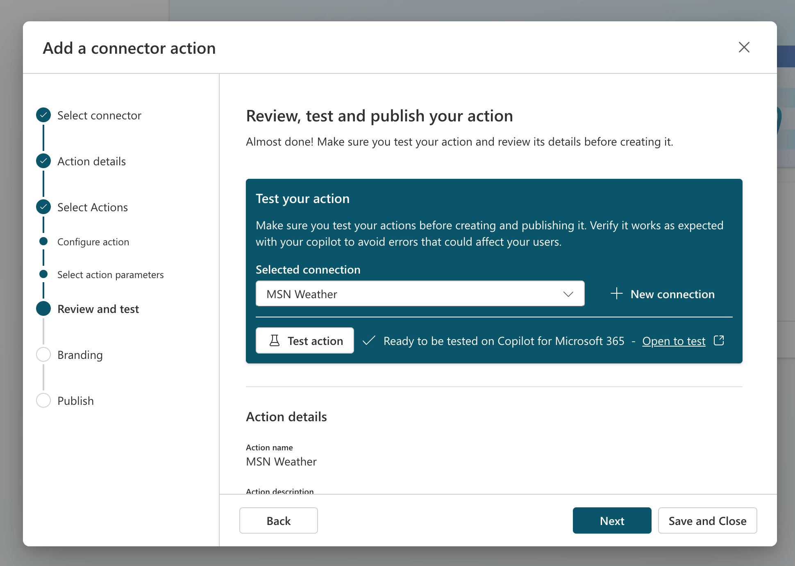

# تدريب: إنشاء إجراء موصل

في هذا التمرين، ستقوم بما يلي:

- إنشاء إجراء موصل في Copilot Studio
- اختبار إجراء الموصل في Microsoft Teams
- حفظ إجراء الموصل ونشره

## مهمة 1: إنشاء إجراء موصل في Copilot Studio

في هذه المهمة، ستقوم بتكوين إجراء موصل لموصل الطقس من MSN.

1. انتقل إلى [Copilot Studio](https://copilotstudio.microsoft.com) وسجل الدخول باستخدام حساب العمل أو المؤسسة التعليمية، إذا طلب منك ذلك. تخطي أي رسائل ترحيب.

    **ملاحظة:** في المرة الأولى التي تفتح فيها Copilot Studio، قد يعرض واجهة دردشة لإنشاء أول Copilot خاص بك. إذا حدث ذلك، فحدد **...** في أعلى اليمين (بجوار زر **إنشاء**) ثم حدد **إلغاء إنشاء Copilot** لمغادرة واجهة الدردشة وعرض الصفحة الرئيسية لـ Copilot Studio.
1. حدد **المكتبة** في جزء التنقل الأيسر. هنا، يمكنك عرض قائمة بالإجراءات والموصلات الموجودة وإنشاء واحدة جديدة.
1. حدد **إضافة عنصر** في الأعلى.  قائمة تدرج خيارين لتوسيع Copilot لـ Microsoft 365.
:::image type="content" source="../Media/extend copilot options.png" alt-text="تدرج النافذة خيارين لتوسيع Copilot: إنشاء Copilot أو إنشاء إجراء.":::
2. حدد **إجراء جديد**.
3. حدد **موصل** لفتح معالج إجراءات الموصل.
4. حدد **الطقس من MSN** كموصل.
5. **راجع** الوصف.

    > [!IMPORTANT]
    > هذا الوصف مهم جدًا لأن Copilot سيستخدم هذا لمطابقة رسالة المستخدم مع المكون الإضافي الخاص بك. إذا لم يكن لديك وصف جيد، فقد لا يقوم Copilot بتشغيل إجراء الموصل.

1. حدد **التالي**.
1. حدد إجراء **الحصول على حالة الطقس الحالية**.
1. **راجع** وصف الإجراء.

    > [!IMPORTANT]
    > راجع وصف الإجراء في الشاشة التالية. وصف الإجراء هذا مهم جدًا لأن Copilot سيستخدم هذا لمطابقة رسالة المستخدم مع الإجراء الخاص بك. إذا لم يكن لديك وصف إجراء جيد، فقد يشغّل Copilot إجراء خاطئ.

1. حدد **التالي**.
1. **راجع** أوصاف جميع الإدخالات والنتائج.

    > [!IMPORTANT]
    > راجع أوصاف الإدخال والناتج في الشاشة التالية. أوصاف الإدخال والناتج هذه مهمة جدًا لأن Copilot سيستخدم هذه الأوصاف لتشغيل الموصل (الإدخالات) وكتابة رد جيد (النتائج) لك. إذا لم يكن لديك أوصاف إدخال وناتج جيدة، فقد لا يقوم Copilot بتشغيل الموصل بشكل صحيح أو لن يرسل رد جيد.

1. حدد **التالي**.
1. بعد ذلك، سترى شاشة حيث يمكنك إضافة المزيد من الإجراءات إذا كنت تريد ذلك، ولكن في هذه الحالة سوف نتخطى هذا وحدد **التالي**.

## مهمة 2: اختبار إجراء الموصل في Microsoft Teams

في هذه المهمة، ستختبر إجراء الموصل الذي قمت بتكوينه في المهمة 1 في Microsoft 365 Copilot في Microsoft Teams.



1. حدد اتصال موجود بالفعل إذا كان لديك واحدًا، أو حدد **موصل جديد** لإنشاء موصل جديد لموصل الطقس من MSN.
1. في قائمة **موصل جديد**، حدد **إنشاء**.
1. ضمن **اتصال محدد**، يمكنك الآن تحديد اتصالك الجديد من القائمة المنسدلة.
1. حدد زر **اختبار الإجراء**.

    > [!NOTE]
    > سيؤدي ذلك إلى تشغيل عملية حيث سيتم نشر إجراء الموصل إلى Microsoft Teams بحيث يمكنك اختباره.

1. حدد **فتح للاختبار** للاختبار.

    > [!NOTE]
    > سيؤدي ذلك إلى فتح علامة تبويب متصفح جديدة وسيحاول تشغيل Microsoft Teams.

1. لا تتردد في تحديد **إلغاء** في النافذة المنبثقة حيث يحاول تشغيل Microsoft Teams.
1. حدد **استخدام تطبيق الويب بدلًا من ذلك**.

    > [!NOTE]
    > سيؤدي ذلك إلى فتح Microsoft 365 Copilot في Microsoft Teams.

1. من منطقة إنشاء الرسالة في Copilot في Teams، حدد أيقونة **المكون الإضافي** بجوار أيقونة الإرسال.
1. حدد موقع المكون الإضافي **اختبار-الطقس من MSN** وحدد زر التبديل لتمكينه.

    > [!NOTE]
    > سيظهر هذا الرسالة التالية.

    


1.  أرسل الرسالة التالية إلى Microsoft 365 Copilot، واملأ القيم لموقعك ووحداتك المطلوبة.

    ```text
    What is the current weather in <your location> in <celsius/fahrenheit> according to MSN Weather?
    ```

1. إذا سار كل شيء على ما يرام، يجب أن يستجيب Copilot برسالة باستخدام المكون الإضافي.  

   

   **ملاحظة:** قد يطالبك Copilot بالحصول على إذن قبل استخدام المكون الإضافي.  حدد **السماح دائمًا** لتمكين Copilot لاستخدام المكون الإضافي.

   :::image type="content" source="../Media/test-msn-weather-allow.png" alt-text="لقطة شاشة لمطالبة Copilot بالحصول على إذن لاستخدام المكون الإضافي.":::

## مهمة 3: حفظ ونشر إجراء الموصل

في هذه المهمة، ستحفظ إجراء الموصل وتنشره.

دعونا نستكمل من حيث توقفنا في Copilot Studio.

1. حدد **التالي** في المعالج وسيتم نشر إجراء الموصل.

    > [!NOTE]
    > في الشاشة التالية، ستتمكن من الانتقال إلى شاشة التفاصيل أو الحفظ والإغلاق. كما هو موضح في الرسالة، قد يستغرق الأمر بضع دقائق حتى يظهر الإجراء في تجارب copilot.

      
   
1. حدد **حفظ وإغلاق**.

لقد قمت الآن بتكوين ونشر إجراء الموصل الخاص بك.
